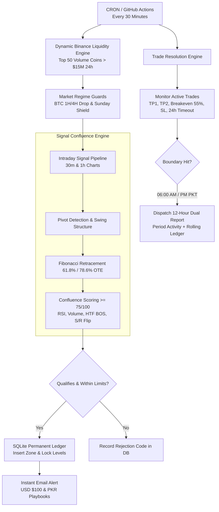

# ⚡ Autonomous Intraday Fibonacci Trading Engine & 15-Day Production Monitor

[](https://github.com/abdurrehmansajidhafiz1-cell/trading-scanner-v2/actions/workflows/scan.yml)
[](https://www.python.org/)
[](https://www.binance.com/)
[](#key-execution-rules)
[](#active-timeframes)
[](#license)

An enterprise-grade, fully autonomous algorithmic crypto market scanner and forward-testing monitor. Engineered specifically for Binance spot markets to detect high-probability **Intraday Fibonacci & Optimal Trade Entry (OTE)** zones across dynamic liquidity pools.

---

## 📊 Live System Status & Dashboard

<!-- LIVE_DASHBOARD_START -->
> **Last Engine Sync:** `2026-09-18 04:25 AM PKT` (`2026-09-17 23:25 UTC`) | **Cycle:** `Day 15 of 15`

### 📈 Live Performance Key Metrics

| Metric | Value | Status Indicator |
|---|---|---|
| **Production Phase** | `Day 15 of 15` | 🟢 Active Tracking |
| **Total Setups Qualified** | `33` | 🎯 High Confluence (>=75/100) |
| **Resolved Trades** | `9` (5W / 4L / 10BE) | ⚖️ Real Execution Cost Modeled |
| **Cumulative Win Rate** | **`55.6%`** | 🟢 Profitable |
| **Net Realized P&L** | **`+20.86 R`** | 🟢 Positive Expectancy |
| **Profit Factor** | **`6.23`** | Target: > 1.50 |
| **Active / Pending Setups** | `0` open positions | Max 3 Concurrent Allowed |

### 🔴 Active & Monitored Trades Live Tracker

> *Abhi market mein koi active/pending trade nahi hai — engine har 5 minute baad high-confluence OTE setups dhoond raha hai.*

### 📜 Recent Closed Trades Ledger (Day 1 se Aaj Tak)

| ID | Coin | TF | Result | Realized P&L ($100 Base) | Entry Price | Target 1 | Stop Loss | Resolved Time (PKT) |
|---|---|---|---|---|---|---|---|---|
| #65 | **CRCLB/USDT** | `30m` | 🔴 **LOSS (SL Hit)** | **-3.76 USDT** (Rs. -1,053) | `91.9164` | `97.6130` | `89.2207` | 2026-09-15 06:30 PM PKT |
| #64 | **FIL/USDT** | `30m` | 🔴 **LOSS (SL Hit)** | **-6.56 USDT** (Rs. -1,837) | `0.9562` | `1.0300` | `0.9028` | 2026-09-15 05:00 AM PKT |
| #63 | **SOL/USDT** | `30m` | ⚪ EXPIRED | 0.00 USDT | `99.6420` | `101.8500` | `98.3571` | 2026-09-14 08:30 PM PKT |
| #62 | **TAO/USDT** | `30m` | ⚪ EXPIRED | 0.00 USDT | `231.1836` | `236.6300` | `227.4372` | 2026-09-14 02:30 PM PKT |
| #60 | **UNI/USDT** | `30m` | 🟢 **WIN (Target Hit)** | **+0.49 USDT** (Rs. +137) | `6.3154` | `6.4752` | `6.1938` | 2026-09-13 08:00 AM PKT |
| #61 | **ETH/USDT** | `30m` | 🔴 **LOSS (SL Hit)** | **-0.90 USDT** (Rs. -252) | `2516.6372` | `2544.1415` | `2500.8994` | 2026-09-13 01:30 PM PKT |
| #59 | **NEAR/USDT** | `30m` | ⚪ **BREAKEVEN (Profit Locked)** | **+$2.50 USDT** (Risk-Free) | `2.4096` | `2.5149` | `2.3298` | 2026-09-11 05:00 PM PKT |
| #58 | **ZEC/USDT** | `30m` | 🟢 **WIN (Target Hit)** | **+$18.39 USDT** | `1197.9036` | `1289.7785` | `1147.9484` | 2026-09-09 08:00 PM PKT |
| #57 | **ETH/USDT** | `30m` | 🟢 **WIN (Target Hit)** | **+$13.98 USDT** | `2486.5702` | `2520.9635` | `2461.9653` | 2026-09-09 06:30 PM PKT |
| #55 | **ENA/USDT** | `1h` | ⚪ EXPIRED | 0.00 USDT | `0.1611` | `0.1687` | `0.1557` | 2026-09-09 08:00 PM PKT |

<!-- LIVE_DASHBOARD_END -->


| Metric | Current Production State | Specifications |
|---|---|---|
| **Active Production Phase** | **15-Day Fresh Forward Evaluation** | Starting `2026-09-03 09:30 AM PKT` |
| **Active Timeframes** | **30m & 1h (Pure Intraday)** | 4h eliminated for fast resolution |
| **Scheduled Routine Reports** | **Every 12 Hours** | `06:00 AM PKT` & `06:00 PM PKT` via SMTP |
| **Real-time Signal Alerts** | **Instant Push via Email** | Dual Playbooks: USD ($100) & PKR (Rs. 35k) |
| **Daily Protection Rules** | **Circuit Breaker (-2.0R)** | Max 3 trades/day & 3 concurrent open positions |
| **Market Regime Shield** | **BTC Dump Defense & Sunday Shield** | Blocks entries during weekly close volatility |

---

## 🏗️ Architectural Overview



---

## 🎯 Key Execution Rules & Playbook Parameters

### 1. Dual-Tier Entry Strategy
- **Tier 1 Entry (61.8% Fibonacci Retracement):** 50% Capital allocation.
- **Tier 2 Entry (78.6% OTE Zone):** 50% Capital allocation for optimal cost averaging.

### 2. Multi-Target Profit Taking & Capital Protection
- **Stop Loss:** Volatility-adjusted `1.2x ATR` below Swing Low with strict structure invalidation guards.
- **Dynamic Breakeven:** When price reaches `55%` of the distance between Entry and TP1, the Stop Loss is automatically shifted to Entry (Risk-Free Trade).
- **Target 1 (TP1):** Primary exit at `95%` of Swing High.
- **Target 2 (TP2):** Extended runner at `1.618 Fibonacci Extension`.
- **Holding Period Cap:** Auto-closure / timeout at `24 Hours` to prevent capital lockup in stagnant consolidation.

### 3. Confluence Scoring Weights (100-Point System)
- `30 Pts` — Optimal Trade Entry (OTE 61.8% – 78.6%)
- `25 Pts` — Higher Timeframe (Daily/4H) Market Structure & Trend Alignment
- `20 Pts` — Volume Spike Expansion on Reversal
- `15 Pts` — Momentum Confirmation (RSI Oversold / Divergence)
- `10 Pts` — Prior Support/Resistance S/R Flip

---

## 📁 Repository Structure

```text
├── .github/workflows/
│   ├── scan.yml               # Automated 30-minute GitHub Actions scanner & monitor
│   └── backtest.yml           # Historical backtesting automation pipeline
├── coin_universe.py           # Dynamic Binance liquidity & volatility screener
├── config.py                  # Central configuration, risk parameters & thresholds
├── database.py                # SQLite database management layer & transactions
├── data_fetcher.py            # Multi-exchange data retrieval & OHLCV formatting
├── email_sender.py            # Secure TLS/SSL SMTP email delivery engine
├── exchange_manager.py        # Exchange fallback and rate-limiting orchestrator
├── failure_analyzer.py        # Post-trade diagnostic & loss-tagging algorithm
├── indicators.py              # Pure vectorised mathematical indicators (EMA, RSI, ATR)
├── logging_setup.py           # Structured logging configuration
├── main.py                    # Main CLI entry point for CI/CD runners
├── pivot_detection.py         # Adaptive ATR-percentile pivot swing detection
├── reporting.py               # Comprehensive 12-hour dual reporting & alert builder
├── scanner.py                 # Core market scanning loop & trade resolution engine
├── signal_engine.py           # Fibonacci OTE confluence engine & invalidation guards
├── test_offline.py            # Comprehensive offline regression unit test suite
├── timezone_utils.py          # Dual UTC & Pakistan Standard Time (PKT) utilities
└── trading_system.db          # Embedded SQLite permanent database
```

---

## 🚀 Deployment & Secrets Setup

This engine runs fully autonomously using **GitHub Actions**. To deploy:

1. Fork or clone this repository.
2. Navigate to **Settings** > **Secrets and variables** > **Actions**.
3. Add the following repository secrets:
   - `SMTP_HOST`: e.g. `smtp.gmail.com`
   - `SMTP_PORT`: `587`
   - `SMTP_USER`: Your email address
   - `SMTP_PASSWORD`: Application-specific password
   - `REPORT_EMAIL_TO`: Recipient email address
   - `MIN_RR`: `1.3` (default minimum risk-reward ratio)
4. Enable GitHub Actions in the **Actions** tab. The scanner will run every 30 minutes.

---

## 🛡️ Risk & Safety Compliance

- **Zero Financial Risk:** The live scanner performs pure market-data observation and forward testing. Order execution and financial fund handling are strictly isolated.
- **Credential Protection:** Secrets are never hardcoded and are read strictly via environment variables.
- **Empirical Validation:** All modifications are pre-validated with local regression tests (`test_offline.py`) before remote deployment.

---

## 📜 License
Proprietary algorithmic trading framework. All rights reserved.
